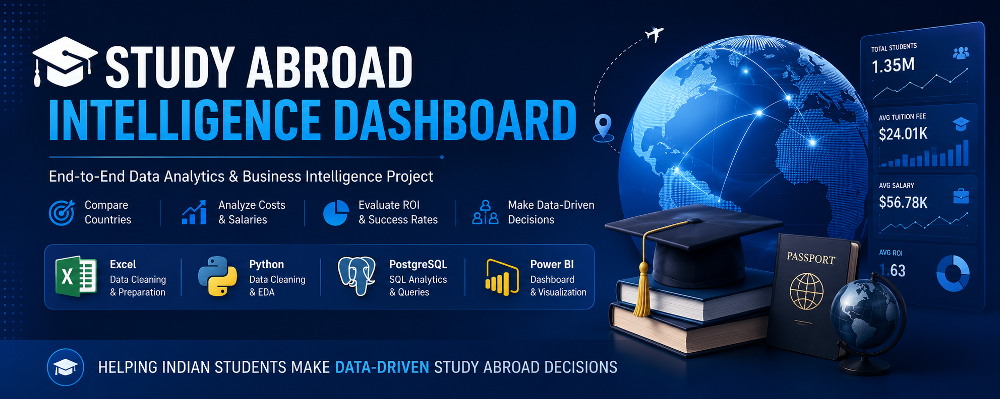
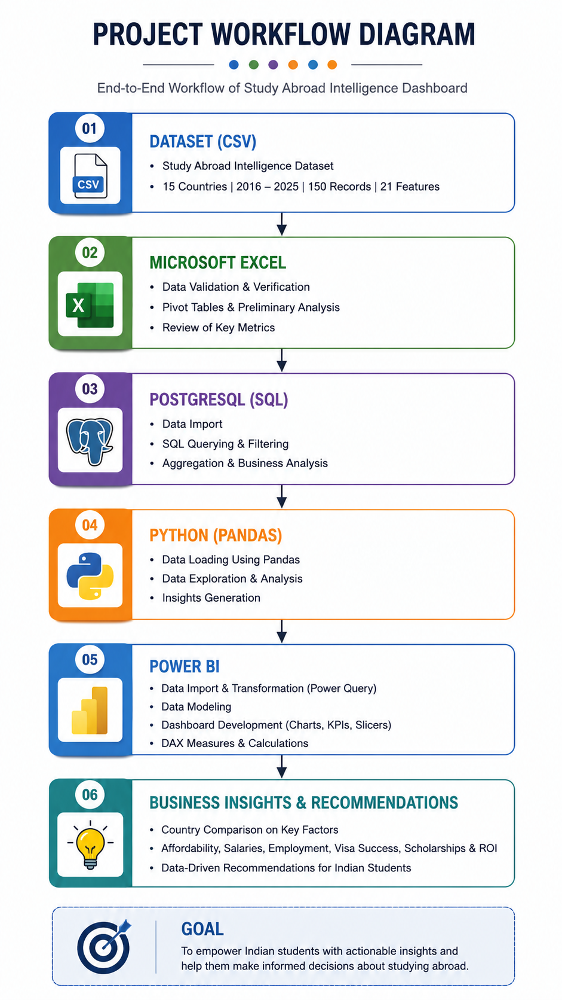
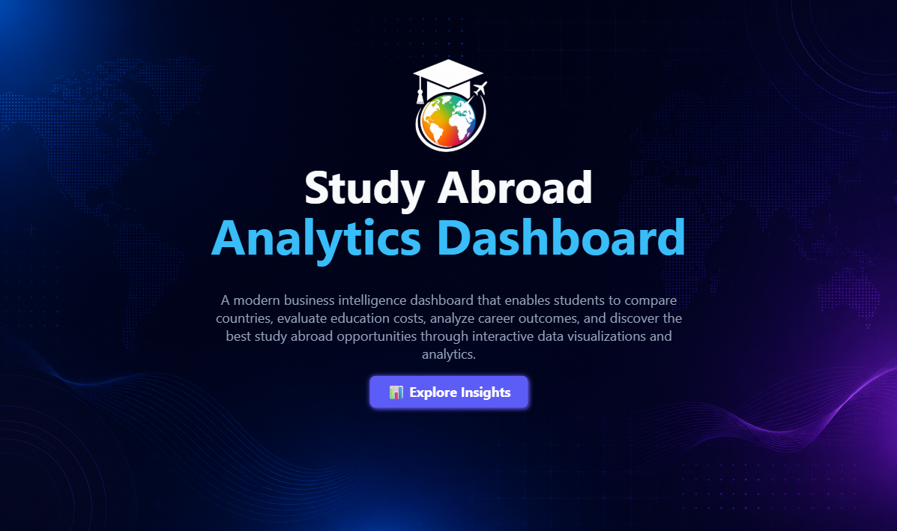
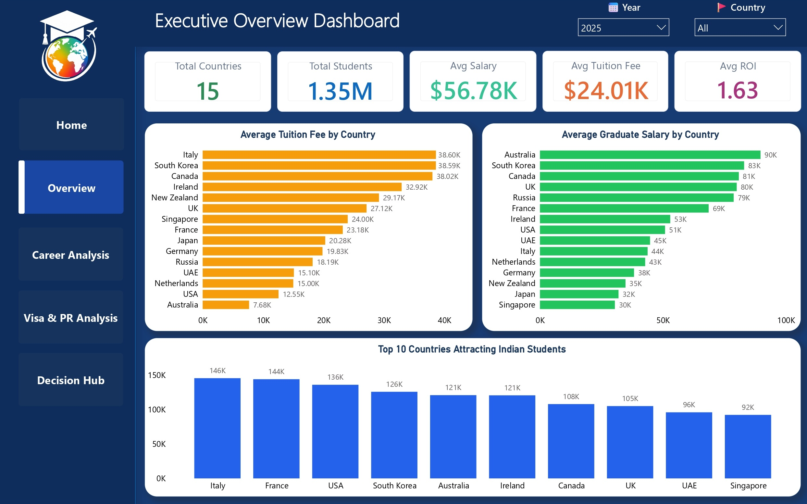
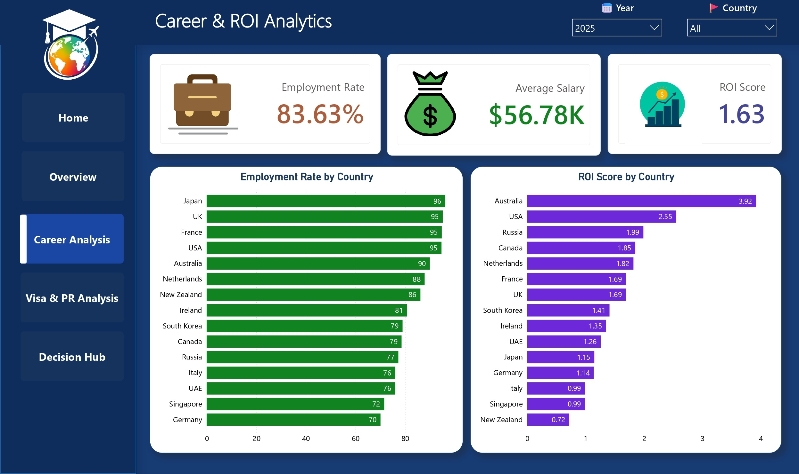
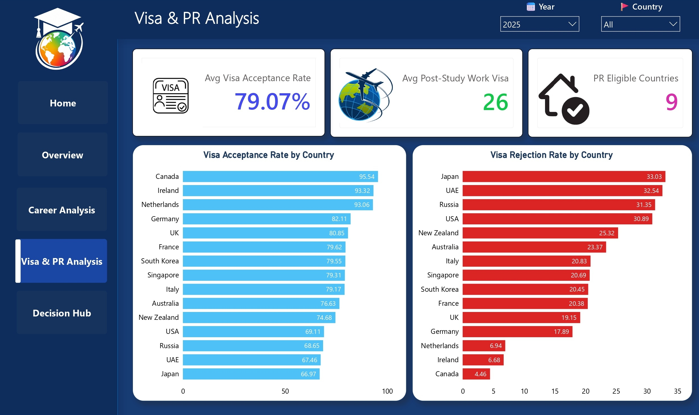
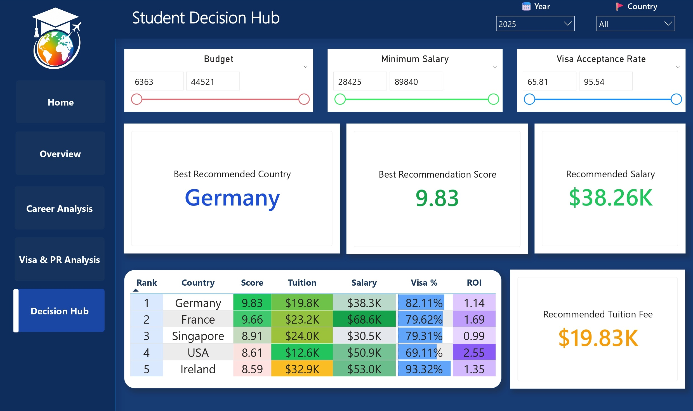

  

<h1 align="center">🎓 Study Abroad Intelligence Dashboard for Indian Students</h1>

An End-to-End <b>Data Analytics & Business Intelligence</b> project that helps Indian students compare study abroad destinations using <b>Excel, Python, PostgreSQL, and Power BI</b>.

---

<h1 align="center">📌 Project Overview</h1>

Choosing the right country for higher education can be challenging because students need to compare tuition fees, living expenses, graduate salaries, employment opportunities, scholarships, visa success rates, and return on investment (ROI).

This project provides an interactive Business Intelligence Dashboard that transforms raw educational data into meaningful insights, helping Indian students make informed decisions about studying abroad.

The project follows the complete Data Analytics lifecycle from data preprocessing to dashboard development using Excel, Python, PostgreSQL, and Power BI.

---

<h1 align="center">🎯 Business Problem</h1>

Students often rely on scattered information available across multiple websites, making country comparison difficult and time-consuming.

This project solves that problem by integrating educational, financial, career, and visa-related information into a single interactive dashboard.

---

<h1 align="center">🎯 Objectives</h1>

- Compare study destinations using data-driven insights
- Analyze tuition fees and living expenses
- Compare graduate salaries and employment rates
- Evaluate Return on Investment (ROI)
- Analyze visa success rates
- Compare scholarship opportunities
- Build an interactive Power BI dashboard
- Help students make better study abroad decisions

---

<h1 align="center">🛠 Tech Stack</h1>

| Technology | Usage |
|------------|-------|
| 📊 Microsoft Excel | Data Cleaning & Validation |
| 🐍 Python (Pandas) | EDA & Feature Engineering |
| 🗄️ PostgreSQL | SQL Analysis |
| 📈 Power BI | Dashboard Development |
| ⚡ Power Query | ETL & Data Transformation |
| 🧮 DAX | KPI & Business Metrics |
| 🌐 Git & GitHub | Version Control |

---

<h1 align="center">📂 Dataset Information</h1>

| Attribute | Value |
|------------|---------|
| Domain | Higher Education Analytics |
| Countries | 15 |
| Records | 150 |
| Features | 21 |
| Time Period | 2016 – 2025 |
| File Format | CSV |

---

<h1 align="center">📊 Project Workflow</h1>

  

---

<h1 align="center">📷 Dashboard Preview</h1>

## 🏠 Home Page

The landing page introduces the project and provides navigation to all dashboard sections.

---

## 📊 Executive Overview Dashboard

This page provides a complete overview of the dataset through interactive KPI cards and visualizations.

### Highlights

- 🌍 Total Countries
- 👨‍🎓 Total Students
- 💰 Average Tuition Fee
- 💼 Average Graduate Salary
- 📈 Average ROI
- 📊 Country Comparison

---

## 💼 Career & ROI Analytics

Analyze graduate salaries, employment rates, and ROI to identify countries with the best career opportunities.

### Highlights

- Employment Rate
- Graduate Salary
- ROI Comparison
- Top Performing Countries

---

## 🛂 Visa & PR Analysis

Compare visa acceptance rates, visa rejection rates, PR availability, and post-study work opportunities.

### Highlights

- Visa Acceptance Rate
- Visa Rejection Rate
- PR Availability
- Post Study Work Visa

---

## 🎯 Student Decision Hub

An intelligent recommendation page that suggests the most suitable country according to the user's preferences.

### Highlights

- Budget Selection
- Expected Salary
- Visa Acceptance Rate
- Best Recommended Country
- Recommendation Score

---

<h1 align="center">📊 SQL Analysis</h1>

Business questions answered using PostgreSQL.

- Total Countries
- Average Annual Study Cost
- Top Affordable Countries
- Average Graduate Salary
- Highest Salary Countries
- ROI Analysis
- ROI Ranking
- Visa Success Rate
- Scholarship Ranking
- Best Value Countries
- Country Summary Report

---

<h1 align="center">🐍 Python Analysis</h1>

Performed using Pandas.

- Dataset Loading
- Data Inspection
- Descriptive Statistics
- Missing Value Analysis
- Duplicate Analysis
- ROI Feature Engineering
- Visa Success Rate
- Affordability Score
- Export Processed Dataset

---

<h1 align="center">📌 Power BI Features</h1>

- KPI Cards
- Power Query
- DAX Measures
- Interactive Filters
- Country Slicers
- Year Slicers
- Navigation Buttons
- Cross Filtering
- Drill Down
- Dynamic Dashboard

---

<h1 align="center">💡 Key Business Insights</h1>

✔ Countries offering higher graduate salaries generally have higher tuition costs.

✔ ROI provides better decision-making than tuition fees alone.

✔ Visa approval rates differ significantly across destinations.

✔ Scholarships improve affordability for international students.

✔ Employment rate directly impacts long-term ROI.

✔ Interactive dashboards simplify country comparison and improve decision-making.

---

<h1 align="center">🚀 Skills Demonstrated</h1>

- Data Cleaning
- Data Validation
- Exploratory Data Analysis
- SQL Query Writing
- Feature Engineering
- Dashboard Development
- KPI Design
- Business Intelligence
- Data Storytelling
- Data Visualization
- Problem Solving

---

<h1 align="center">📌 Future Enhancements</h1>

- Live API Integration
- AI-Based Country Recommendation
- Machine Learning Prediction
- University-Level Analysis
- Web Deployment
- Automated Data Refresh
- User Authentication
- Personalized Dashboard

---

<h1 align="center">👨‍💻 Author</h1>

### Nitin Singh

Aspiring Data Analyst passionate about solving real-world business problems through data analytics, SQL, Python, and Power BI.

<h1 align="center">🙌 Thank You</h1>

Thank you for visiting this repository.

If you found this project useful, consider giving it a ⭐ on GitHub.
